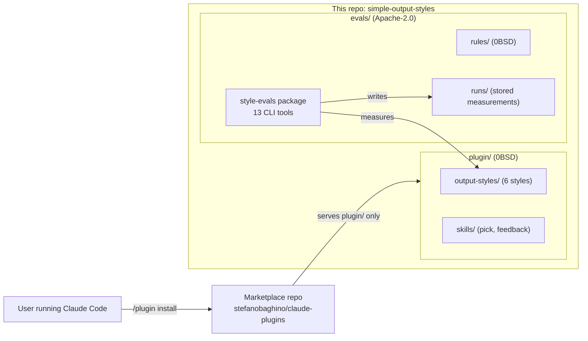
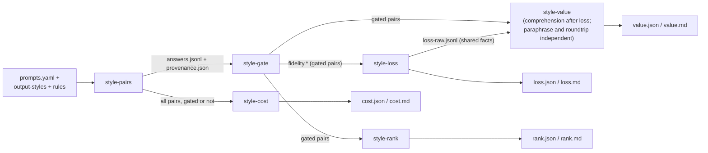
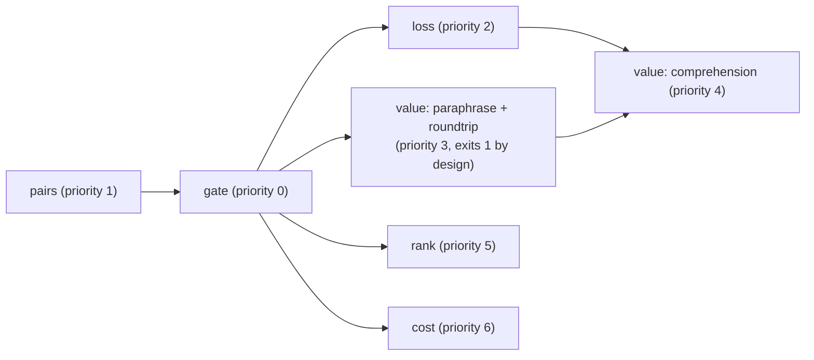

# Architecture

This document describes how the evaluation harness is built and why.
For commands, flags, and exit codes, see the
[operations guide](OPERATIONS.md). For procedures such as adding a
style, see [CONTRIBUTING.md](CONTRIBUTING.md). For the latest
measured findings, see [RESULTS.md](RESULTS.md).

## Repository overview

The harness lives in `evals/`, apart from the plugin it measures.
The split is deliberate: the marketplace serves only the `plugin/`
directory, so installers never receive the harness.

The Apache License 2.0 covers `evals/`, with one exception: the rule
files in `rules/` stay under the Zero-Clause BSD license of the
repository root, so a fork of a style can take its matched rule file.
The License section of the top-level `README.md` states the full
split.

## Harness components

The harness has twelve components. Each one is a CLI tool, and the
tools compose through stored artifacts, never through shared state.

| Component | Command | What it measures or does | Main artifacts |
|---|---|---|---|
| Linter | `style-lint` | Checks one Markdown text against the writing rules of a style and reports each violation, plus a rate per 100 sentences. Deterministic. | stdout report |
| Pair runner | `style-pairs` | Produces, per prompt, one answer per style and one shared unstyled answer, through the Claude Code CLI, with full provenance. | `answers.jsonl`, `provenance.json`, `report.md` |
| Fidelity gate | `style-gate` | Marks each pair pass or fail with the rules of its style, because a non-compliant answer does not represent its style. | `fidelity.jsonl`, `fidelity.json`, `fidelity.md` |
| Token-cost report | `style-cost` | States the fixed input overhead of the style block per request and the distribution of the styled-to-unstyled output-token ratio. | `cost-probe.json`, `cost.json`, `cost.md` |
| Reader-value report | `style-value` | Compares the two answers of a gated pair on three reader-facing checks — comprehension, paraphrase, translation round-trip — as win, loss, or tie. | `value-raw.jsonl`, `value.json`, `value.md` |
| Content-loss report | `style-loss` | Measures the facts of the unstyled answer that survive in the styled answer, the facts only the styled answer states, and each hedged claim that survives, hardens, or drops. | `loss-raw.jsonl`, `loss.json`, `loss.md` |
| Drift report | `style-drift` | Lints every turn of scripted long sessions and gives a verdict per style: flat or growing. A deep mode drives the sessions into deep context. | `sessions.jsonl`, `drift.json`, `drift.md` |
| Cross-run comparison | `style-compare` | States the spread per style and axis across runs with identical conditions: the error bar of the harness. | `compare.json`, `compare.md` |
| Clarity ranking | `style-rank` | Runs blind head-to-head contests, with the unstyled answer as a competitor, and fits one Bradley-Terry strength per competitor. | `rank-raw.jsonl`, `rank.json`, `rank.md` |
| Campaign driver | `style-campaign` | Runs several full runs under one schedule and one worker budget. A screening mode gives a cheap first verdict on a candidate style. | run directories |
| Regression-targets check | `style-targets` | Compares one run against pre-committed limits per style and axis, so a style change fails loudly on a regression. | `targets.json`, `targets.md` |
| Second-judge agreement | `style-agreement` | Re-runs the stored discrete verdicts with a second judge model and reports the agreement rate per axis, so a judge-sensitive axis is visible before the style-design loop optimizes against it. | `agreement-<model>-raw.jsonl`, `agreement.json`, `agreement.md` |

A thirteenth tool, `style-provision`, is infrastructure rather than
measurement: it manages the pinned CLI binary, as
[Pins and comparability eras](#pins-and-comparability-eras)
describes. For the other planned components, see the tracking issue
in this repository.

## Measurement pipeline

Four tools stay out of the diagram because they consume stored
artifacts offline or own their run family: `style-compare` and
`style-targets` read the `.json` artifacts of complete runs,
`style-agreement` re-judges the stored raw files, and `style-drift`
measures sessions in its own `-drift` run directories.

The pipeline enforces these structural rules:

- **The gate is the fidelity filter.** A non-compliant answer does
  not represent its style, so the judged measurements (value, loss,
  rank) read only the pairs with a true pass mark. The token-cost
  report reads all pairs, because the cost of a style does not
  depend on rule obedience.
- **Comprehension follows loss.** The comprehension questions come
  from the shared facts of a pair, which the content-loss check
  mines in both directions. The check reads those facts from
  `loss-raw.jsonl` once, at its start, which creates the one hard
  ordering dependency of the pipeline.
- **No judge call sees both answers of a pair.** In the loss and
  value tools, only the extracted items travel between calls, never
  the source texts. The clarity ranking relaxes this invariant on
  purpose: a clarity contest is a choice, so the judge sees both
  texts. Blindness holds through the absence of labels — no prompt
  names a style or an arm — and every contest runs in both orders,
  so a position preference cancels.
- **Judges differ from the writer.** The judge models must differ
  from the writer model of the run, and every model alias is pinned
  to one exact model ID.

## Rules as data

The engine is shared, and the rules are data. Each style has one
rule file, `rules/<style>.rules.yaml`, whose header comment
documents the exclusions of the style: the rules that need judgment
and thus stay outside the mechanical checks.

Two policy files live apart from the rules, so a policy edit never
changes the rule-file hashes in the provenance:

- `rules/gate.yaml` holds the pass threshold per style, as the
  highest violation rate per 100 sentences that passes. The
  thresholds differ per style, because the rule counts differ and
  the rates are not comparable across styles.
- `rules/targets.yaml` holds the regression limits per style and
  axis, with the derivation of each number in the header comment.

The token axis in `rules/targets.yaml` is a bound, not a target: the
style-design loop optimizes readability alone, so the bound is what
pushes back on verbosity, and no bonus exists for savings under it.
Two axes stay out of the targets on purpose: the reader-value net
wins move too much across identical runs for a target, and the
violation rate belongs to the gate policy.

## The style field

The measured styles form the field: the competitor set of every
campaign, and the reference frame for a candidate style. Each member
derives from one published writing guideline, picked for diversity
of philosophy, because the references carry human validation from
outside the harness. The members:

- **classic-concise** — The Elements of Style (Strunk, 1918):
  classic prescriptive concision, omit needless words.
- **clarity-flow** — Style: Toward Clarity and Grace (Williams):
  reader-centered clarity, actors as subjects, actions as verbs, old
  information before new.
- **developer-docs** — the Google developer documentation style
  guide: the modern industry documentation voice, for a global
  audience.
- **plain-language** — the Federal Plain Language Guidelines:
  government plain language, reader first.
- **technical-simplified** — ASD-STE100 Issue 9: controlled
  technical language with a restricted vocabulary and grammar.
- **actionable-clarity** — the accepted candidate of the #83 design
  loop: a synthesis of plain-language organization, developer-docs
  directness, and clarity-flow information flow, with
  content-preservation and uncertainty rules of its own. Unlike the
  other members, it carries no independent human validation: the
  wording was tuned against the harness itself, and the human spot
  check of its acceptance measured a 0.50 agreement with the
  clarity judge, below the 0.7 anchor. The maintainer accepted the
  style by explicit overrule, recorded in the spot-check file of
  `runs/2026-08-10d` and in the acceptance PR.

The field also carries one reference competitor from outside the
plugin: **concise**, the output style built into the Claude Code CLI
(2.1.237 and later). Its text ships inside the pinned CLI binary,
not under `plugin/output-styles/`, so the harness activates it
through the bare `outputStyle` value `Concise`, loads no plugin on
its arm, and pins its text through the CLI version pin instead of a
file hash. The provenance of a run records that identity as a
`builtin` entry with the CLI version in place of a file sha256.

The first five members were frozen as the field of #79: they are the
competitor set of the baseline, and `runs/2026-08-07` is the
calibration run of the field. The acceptance of actionable-clarity
(#83) re-opened the field once, through the acceptance process in
[CONTRIBUTING.md](CONTRIBUTING.md); its calibration runs are
`runs/2026-08-10d` to `f`. An extension campaign later brought the
candidate to the six-sample error bar of the field:
`runs/2026-08-10g` to `i` reuse the pre-pin baselines
`runs/2026-08-07` to `2026-08-08b`, and the six-run spread is
`runs/2026-08-10c-compare`. Two of the extension runs measured hedge
survival under the 0.90 floor (0.75 and 0.80, in the targets files
of `runs/2026-08-10g` and `i`), against unstyled baselines that
hedge more than the acceptance baselines did. The candidate also has
a deep drift run of its own, `runs/2026-08-10-drift-deep`: flat,
with a non-degenerate null, at 152 percent of the context window.
[RESULTS.md](RESULTS.md) reports the current numbers.

A later addition goes through the same process and re-opens the
field on purpose. Every member adds a linear cost to every campaign,
so an addition needs a reason that a smaller field cannot serve. The
reuse layer (#76) keeps the cost of an addition linear in practice:
a new run with `--reuse-from` imports the stored rows of the frozen
field, so the addition costs the calls of the new member plus its
new contests. See [Reuse across runs](OPERATIONS.md#reuse-across-runs).

## The held-out prompt set

The style-design loop optimizes a candidate style against the scores
on `prompts/prompts.yaml`, so a candidate can overfit that set. The
held-out set in `prompts/holdout.yaml` exists for the final check:
24 prompts, 6 per task type, with 4 confident and 2 hedge-rich
prompts per type, the same mix as the main set. The ids carry the h
mark (`explanation-h01`), so the two sets stay disjoint under any
growth of the main set.

The isolation policy: the design loop never reads the held-out set.
No artifact of the held-out set — no answers, no scores, no
reports — enters the design loop. A candidate style runs over the
held-out set once, as the final check, after the design loop has
picked it. A candidate that wins on the main set but not on the
held-out set is overfit. A screening run never uses the held-out
set, and the pair runner refuses the flag combination. Held-out runs
land in their own `runs/<date>-holdout` directory family, and the
prompt-set hash in the provenance separates them from main-set runs
in every comparison.

## Hermetic isolation

Every live call — generation, probe, judge, and drift — runs inside
one isolation layer, so an answer reflects the prompt and the style,
never the machine. The isolation is a set of independent guarantees:

| Guarantee | Mechanism | What it prevents |
|---|---|---|
| No workspace context | Every call runs in an empty temp directory outside the repository. | The CLI loads instruction files, the memory index, and the git state from the ancestor directories of its cwd. |
| No user configuration | Each tool invocation builds one fresh config directory and points the CLI at it through `CLAUDE_CONFIG_DIR` — recorded as the config mode. | The user's plugins and settings shape a measured answer. |
| A clean environment | Only `HOME`, `PATH`, `TERM`, `USER`, and the config variable pass through; the inherited environment stays out. | Stray variables change call behavior between machines. |
| No plugin leaks | The runner asserts that every call reports exactly the declared plugins: the harness plugin where the call passes `--plugin-dir`, and none otherwise. A leak fails the call without a retry. | A foreign plugin loads into a measured call. |
| No agentic surface | No tools, no MCP servers, no hooks, one turn, and no dynamic system-prompt sections. | Tool use and injected context contaminate the answer. |
| Credential hygiene | Precedence: `ANTHROPIC_API_KEY`, else `CLAUDE_CODE_OAUTH_TOKEN`, else a mode-600 copy of `~/.claude/.credentials.json` that is removed with the config directory. | The credential lands in the run data. |
| Capped cache-write billing | `FORCE_PROMPT_CACHING_5M` forces the 5-minute prompt-cache lifetime on every call. | Subscription-billed calls default to the 1-hour lifetime, whose cache writes cost 2 uncached-token equivalents against 1.25. |

The billing route and the cache lifetime change the invoice of a
call and never its answer, so neither enters the config manifest,
and neither opens a comparability era. Without a credential, a tool
warns and proceeds, and the first live call fails with zero tokens
spent.

## Pins and comparability eras

Measurements are only comparable when their conditions match, so
everything that shapes an answer is pinned, and every pin change
opens a comparability era: the cross-run comparison warns across the
boundary and stays silent inside it.

| Role | Alias | Pinned resolution |
|---|---|---|
| Writer | `sonnet` | `claude-sonnet-5` (`WRITER_MODEL_PINS` in `src/runner/generate.py`) |
| First judge and grader | `opus` | `claude-opus-5` (`JUDGE_MODEL_PINS` in `src/value/judges.py`) |
| Weak reader, cross-line judge | `haiku` | `claude-haiku-4-5-20251001` (same table) |
| Claude Code CLI | — | `CLI_VERSION_PIN` in `src/runner/pin.py` |

The pins are enforced, not advisory. The runner checks the
resolution of every generation call against the init event; a call
that resolves elsewhere stops the whole run with exit code 2,
without a retry, because the mismatch is not transient and a run
that continued would split its answers across writer models. Every
live invocation checks the installed CLI version against the pin
before its first billed call and stops with exit code 2 on a
mismatch. The CLI version pin also pins the text of a built-in
style, because that text ships inside the CLI binary. Offline scoring is version-free, so every stored run
rescores under any installed CLI. `--accept-cli-version` documents
an intentional upgrade; the pin-update procedure lives in
[CONTRIBUTING.md](CONTRIBUTING.md#update-a-pin).

`style-provision` makes the pinned binary harness-managed: it fills
a store at `~/.local/share/style-evals/cli/<version>/claude`, and
the hermetic environment puts a present managed binary at the front
of the call `PATH`. The provision command is the only part of the
harness that touches the network, and only when it downloads; run
time makes no network call. A provisioned binary still goes through
the version check, so the store is a convenience, never the
guarantee.

What opens a comparability era, and what stays outside:

| Opens an era | Stays outside |
|---|---|
| The prompt-set hash (`prompts.yaml`, `holdout.yaml`, drift session scripts) | The credential route |
| The style text hashes and rule-file hashes | The binary source (managed store or `PATH`) |
| The writer model pin | The cache lifetime |
| The CLI version (also the text pin of a built-in style) | The probe repeat count |
| The workdir mode, and the config mode with its manifest hash | The worker counts (`--parallel`, `--budget`) |
| The resolved judge models and the judge-prompt template hashes | Reuse (`--reuse-from`) |
| The fact-mine design | The timing and token-count fields |

One decision record belongs here: after the measured audit of issue
#74, the judge prompts stay un-cache-optimized on purpose. Every
template already puts its fixed instructions first, the CLI exposes
no cache-control surface for a `-p` call, and every fixed block sits
far below the cacheable minimum of the judge models, so a
manufactured cacheable preamble would cost more than it saves.

## Campaign scheduling

A campaign is several runs under identical conditions, produced for
the cross-run comparison. The driver schedules the stages of each
run around four data dependencies:

- The gate needs the complete pair set of its run.
- The cost report needs the complete pair set of its run.
- The judged reports need the gate marks of their run.
- Only the comprehension check of `style-value` needs the complete
  `loss-raw.jsonl` of its run, so the paraphrase and round-trip
  checks run next to the loss pass. Comprehension also waits for
  the paraphrase and round-trip pass, because both value
  invocations append to `value-raw.jsonl`.

One worker gate meters every CLI call of the campaign: a call takes
a permit before its subprocess starts and returns it when the
subprocess ends, so the live call total never rises above the budget
(48 by default). A stage that runs alone can use the whole budget,
because an idle permit is free for any live stage. When calls
compete, the permit goes to the stage with the lower priority
number — the stage that is earlier in the schedule — so the
critical path stays fast. The next run starts its `pairs` stage when
the previous `pairs` stage completes, the judge stages of the runs
overlap without constraint, and the comparison runs last, over the
complete runs. The first value invocation of a run exits 1 by
design, because its comprehension check is not judged yet; the
driver reports that exit code but does not count it.

The default budget rests on the probe of #73, stored in
`runs/2026-08-07`: at a sustained peak of 48 live calls, the
per-call durations stayed at the light-load means, so 48 sits under
the account saturation. A 3-run campaign of that era expects a wall
clock near 70 minutes at budget 48, and any wall-clock bar must
state the budget and the era it assumes.

The screening mode reduces a campaign to one run over a fixed
subset: 2 prompts per task type, drawn with seed 0 and stratified
over the hedge-rich mark (`HEDGE_RICH_IDS` in
`src/runner/screening.py` — in code, not in the prompt file, because
the provenance hashes the prompt file whole). By design, screening
costs about 8 percent of the generation calls of a full campaign and
about 25 percent of the judge calls of one run; the measurement
against the baseline campaign (`runs/2026-08-08` and
`runs/2026-08-08b`) grounds those fractions in stored rows. The
measured constants are era-scoped: a prompt-set change redraws the
subset and stales them. A screening run carries wider error bars,
every report of the run starts with a screening note, and
`style-compare` rejects a comparison that mixes a screening run with
a full run.

## Run data layout

Stored runs live under `runs/`, one directory per run, named
`<date>` with a letter suffix on a same-day repeat. Within a run,
each measurement tool writes up to three artifacts:

- `<tool>-raw.jsonl` — judge provenance plus one line per raw judge
  call; the append-and-resume surface.
- `<tool>.json` — the scored result, machine-readable.
- `<tool>.md` — the report for a human.

Five directory families exist beside the plain pair run:
`-screening` (fixed subset, wider error bars), `-holdout` (the
held-out prompt set), `-drift` and `-drift-deep` (session
measurements), and `-compare` (cross-run comparisons, which belong
to no single run). The full annotated directory tree lives in the
[run data reference](OPERATIONS.md#run-data-reference).

The storage policy: plain text in plain git — no LFS, no single file
above about 5 MB, and no raw transcripts; store only what the
reports consume. A row imported through the reuse layer carries a
`reused_from` marker and is byte-identical to its source row apart
from that marker, so a run is self-describing about what ran live.

## Exit codes

Every tool follows one convention:

| Code | Meaning |
|---|---|
| 0 | Clean: the tool ran, and nothing needs attention. |
| 1 | Warnings as data: the tool ran; failed pairs, missed targets, or warnings are recorded in the reports. |
| 2 | Cannot run: a pin mismatch, an unscoreable run, or an invalid invocation. Nothing was measured. |

The per-tool meanings live in the
[tool reference](OPERATIONS.md#tool-reference).
